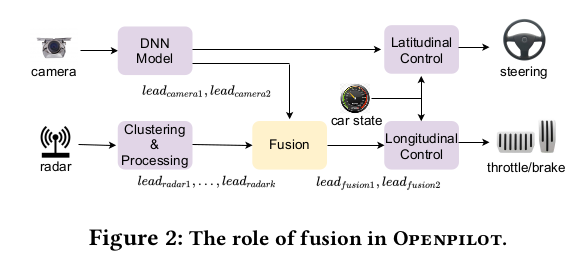

# Detecting Multi-sensor Fusion Errors in Advanced Driver-Assistance Systems
## Motivation
- Multi-sensor Fusion (MSF) is widely used in ADS/ADAS to smooth out the uncertainties brought by sensor outputs  
- Sometimes MSF results are unreliable since it does not know which sensor output to trust, leading to serious consequences.
- Popular MSF methods in an industry-grade ADAS can mislead the
car control and result in serious safety hazards 

## Contributions
- Provide a definition for *fusion error*
- **FusED**: A novel grey-box fuzzing technique for detecting *fusion error*
- Analyze the causes of the fusion errors using causal analysis
- Source Code: https://github.com/AIasd/FusED

## Background
### Fusion in Driving Automation
- Fused sensors include camera, radar, lidar
- High Level Fusion: Fuse the high-level object attributes produced by different sensors (most widely used)
- Low Level Fusion: Fuse raw sensor data
### Fusion in OpenPilot

