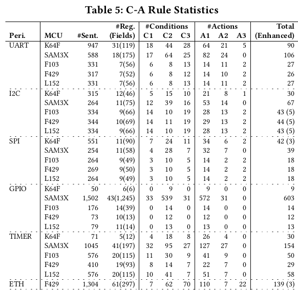
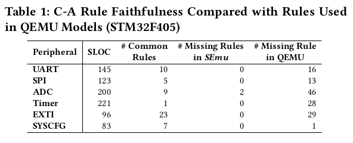
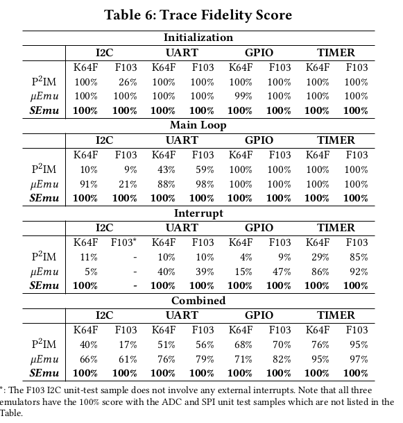
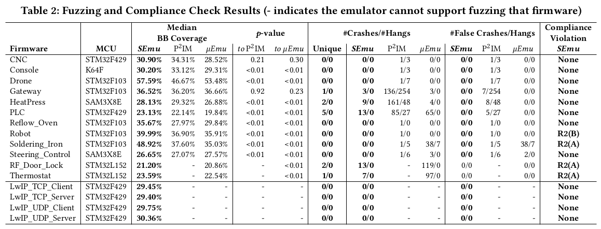

# What Your Firmware Tells You Is Not How You Should Emulate It: A Specification-Guided Approach for Firmware Emulation (CCS 2022)

  

## Motivation
- Emulation is important for firmware dynamic analysis, but emulating firmware of microcontrollers is challenging due to the lack of peripheral models.
- Existing works P2IM, Laelaps, Jetset, Fuzzware, uEmu try to infer peripheral access patterns from firmware itself: **Emulator should generate responses that meet the expectations of firmware so that it does not crash or hang.** However, incomplete and misleading information in firmware undermines the effectiveness, efficiency and applicability of these approaches.
- State diagrams and state tables are widely adopted in chip manuals to specify the peripheral state machines. These information can be helpful for firmware emulation.
## Contributions
- A specification-guided firmware emulation to
more accurately emulate firmware. The core technique is to leverage NLP techniques to automatically extract useful Condition-Action rules from chip manuals.
- Incorporating invalidity-guided emulation to
identify missing or faulty C-A rules extracted by SEmu.
- A new method based on modified edit distance that measures trace similarity.
- Experiment on **STM32F1**, **STM32F4**, **STM32L1**, **NXP K64 series**, and **Atmel SMART series** shows that SEmu achieves much better trace fidelity compared with firmware-guided approaches.
- Successfully uncovered real non-compliance bugs in firmware.


# Background

### MCU Reference Manuals
Chip vendors commonly publish reference manuals for
each chip written in natural language, providing essential information on how to use every
peripheral, including its registers, memory map, hardware interface, and behaviors. A reference manual typically includes:
- Register memory map
- Field description
    - Name
    - Bits
    - Access permissions
    - Functions: **Conditions** and **Actions**
- Interrupt vector table
- DMA channel assignment
### Natural Language Processing
Although reference manuals (mainly in PDF format) are unstructured data, there are observable characteristics in the format and text. Hence, NLP techniques can be used to understand the naturally
expressed sentences and extract condition-action logic from chip manuals.
```
RDRF is set when the number of datawords in the
receive buffer is equal to or more than the number
indicated by RWFIFO[RXWATER].
```
Part-of-speech (POS) tagging to recognize three named entities: RDRF, receive buffer, RWFIFO[RXWATER].  
Constituency Analysis to generate a parse tree to identify conditions and actions.
- Actions: RDRF is set
- Condition: the rest of the sentence

Typed Dependencies Analysis to analyze the grammatical structure, matching the verbs and their corresponding subjects or objects


# Approach

  

## EXTRACTING C-A RULES FROM CHIP MANUALS
Condition-Action (CA) rule describes how important events such as accessing an MMIO register influence the peripheral state.  
A **condition** comprises one
or more predicates combined using the Boolean and operator.  
- Type-1 Condition: via external hardware generated signals
- Type-2 Condition: via firmware generated signals
- Type-3 Condition: via internal generated signals

An **action** is one or more assignment functions.
- Type-1 Action: MMIO register related
- Type-2 Action: Interrupt related
- Type-3 Action: DMA related

Extracting C-A rules has several challenges:  
**How to identify relevant sentences?**  
**Solution:** Collect sentences that contain certain named entities. First collect relevant named entities from  MMIO Register Map. Then scan sentences from field description part that contain at least one named entities. Extend the set of named entities with newly encountered subjects/objects.  
**How to identify and handle co-references?**  
**Solution:** Matching the random noun phrases with
the initial set of named entities extracted from the register memory map. Use approximate string matching to measure the similarity
between an unknown noun phrase with each of the initial set of named entities to identify possible co-references.  
**How to identify conditions and actions?**  
**Solution:** Use Stanford Constituency Parser to analyze the grammatical structure of sentences.  
**How to represent C-A rules?**  
**Solution:** First translate conditions and actions into predicates and assignment functions using Stanford Dependency Parser. Then formulate rule triggers and actions. Last, formulate the C-A rules. For example:
$$
𝐵  \#D[R] ≥ RWFIFO[RXWATER] → S1[𝑅𝐷𝑅𝐹] := 1
$$

## Synthesizing Peripheral Models with C-A rules
Use QEMU to emulate the basic ARM ISA and core peripherals (e.g., NVIC). During firmware emulation, we dynamically build a model for each peripheral, taking the intercepted firmware-peripheral interactions and the extracted C-A rules as input.  
Three types of conditions should be checked during firmware execution. Type-2 and Type-3 condition can be easily checked. For type-1 condition (external hardware triggered conditions), SEmu can only emulate buffer-based and timer-based hardware signals.  

## Diagnosing Faulty/Missing C-A rules
Reasons why C-A rules may be imprecise:  
- SEmu cannot emulate certain hardware
- NLP techniques cannot handle some complex centences  

**Solution:** Use symbolic execution to dectect root cause for emulation failure.
- Select a firmware and corresponding valid test cases that run normally on real devices.
- Use symbolic execution to detect invalid states during emulation with synthesized peripherals.

## Evaluation
Target five chip manuals that cover more than twenty
popular MCU series
- STM32F103, STM32F429, STM32L152
- NXP K64F series
- Atmel SAM3X series

**RQ1: Can our NLP engine automatically extract C-A rules to describe peripheral behaviors?**  
For each manual, we extracted C-A rules for 26 popular peripherals,
including ADC, I2C, SPI, GPIO, UART, Ethernet, etc.  
  

**RQ2: Can the diagnosis tool help correct incorrect rules?**  
In total, we added 26
rules (0.6%) and fixed 21 rules (0.5%) as shown in the brackets in
the last columns of Table 5. To be specific, we added 5 C-A rules to
I2C (F103, F429 and L152, 15 rules in total), 3 rules to ADC DMA
mode (SAM3X), 3 rules for Ethernet (F429), 4 rules for MCG (K64),
and 1 rule for PMC (SMA3); we also modified 6 rules for RCC (F103,
F429 and L152, 18 rules in total) and remove 3 useless rules for SPI
debug mode (K64).  

**RQ3: Are the extracted C-A rules complete and sound?**  
  

**RQ4: Can peripheral models dynamically built with C-A rules provide higher fidelity compared with firmware-guided approaches?**  
To collect traces on real devices, we used
OpenOCD and an external debugging dongle to connect the target boards to the remote gdbserver provided by the chip vendors.  
Three types of traces are considered: initialization trace, main loop trace and interrupt trace. Use edit distance to measure trace fidelity.

  

**RQ5: Will the improved emulation fidelity provide better performance?**  
SEmu successfully reproduced all the bugs mentioned in previous work, but did not report any false crashes or hangs.

 

# Conclusion
Instead of proposing yet another firmware-guided emulation solution, in this work we propose the first specification-based firmware emulation solution. The new approach leverages NLP techniques
to translate peripheral behaviors (specified) in human language (documented in chip manuals) into a set of structured condition-action rules. By properly executing and chaining these rules at runtime, we can dynamically synthesize a peripheral model for each peripheral accessed during firmware execution. We found some non-compliance which we later confirmed to be bugs caused by race condition.
