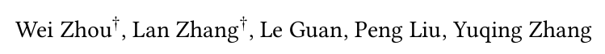
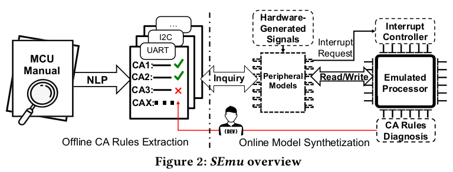

What Your Firmware Tells You Is Not How You Should Emulate
It: A Specification-Guided Approach for Firmware Emulation (CCS 2022)
=====
  

## Motivation
- Emulation is important for firmware dynamic analysis, but emulating firmware of microcontrollers is challenging due to the lack of peripheral models.
- Existing works P2IM, Laelaps, Jetset, Fuzzware, uEmu try to infer peripheral access patterns from firmware itself: **Emulator should generate responses that meet the expectations of firmware so that it does not crash or hang.** However, incomplete and misleading information in firmware undermines the effectiveness, efficiency and applicability of these approaches.
- State diagrams and state tables are widely adopted in chip manuals to specify the peripheral state machines. These information can be helpful for firmware emulation.
## Contributions
- A specification-guided firmware emulation to
more accurately emulate firmware. The core technique is to leverage NLP techniques to automatically extract useful Condition-Action rules from chip manuals.
- Incorporating invalidity-guided emulation to
identify missing or faulty C-A rules extracted by SEmu.
- A new method based on modified edit distance that measures trace similarity.
- Experiment on **STM32F1**, **STM32F4**, **STM32L1**, **NXP K64 series**, and **Atmel SMART series** shows that SEmu achieves much better trace fidelity compared with firmware-guided approaches.
- Successfully uncovered real non-compliance bugs in firmware.


# Background

### MCU Reference Manuals
Chip vendors commonly publish reference manuals for
each chip written in natural language, providing essential information on how to use every
peripheral, including its registers, memory map, hardware interface, and behaviors. A reference manual typically includes:
- Register memory map
- Field description
    - Name
    - Bits
    - Access permissions
    - Functions: **Conditions** and **Actions**
- Interrupt vector table
- DMA channel assignment
### Natural Language Processing
Although reference manuals (mainly in PDF format) are unstructured data, there are observable characteristics in the format and text. Hence, NLP techniques can be used to understand the naturally
expressed sentences and extract condition-action logic from chip manuals.
```
RDRF is set when the number of datawords in the
receive buffer is equal to or more than the number
indicated by RWFIFO[RXWATER].
```
Part-of-speech (POS) tagging to recognize three named entities: RDRF, receive buffer, RWFIFO[RXWATER].  
Constituency Analysis to generate a parse tree to identify conditions and actions.
- Actions: RDRF is set
- Condition: the rest of the sentence

Typed Dependencies Analysis to analyze the grammatical structure, matching the verbs and their corresponding subjects or objects


# Approach

  

## EXTRACTING C-A RULES FROM CHIP MANUALS
Condition-Action (CA) rule describes how important events such as accessing an MMIO register influence the peripheral state.  
A **condition** comprises one
or more predicates combined using the Boolean and operator.  
- Type-1 Condition: via external hardware generated signals
- Type-2 Condition: via firmware generated signals
- Type-3 Condition: via internal generated signals

An **action** is one or more assignment functions.
- Type-1 Action: MMIO register related
- Type-2 Action: Interrupt related
- Type-3 Action: DMA related

Extracting C-A rules has several challenges:  
**How to identify relevant sentences?**  
**Solution:** Collect sentences that contain certain named entities. First collect relevant named entities from  MMIO Register Map. Then scan sentences from field description part that contain at least one named entities. Extend the set of named entities with newly encountered subjects/objects.  
**How to identify and handle co-references?**  
**Solution:** Matching the random noun phrases with
the initial set of named entities extracted from the register memory map. Use approximate string matching to measure the similarity
between an unknown noun phrase with each of the initial set of named entities to identify possible co-references.  
**How to identify conditions and actions?**  
**Solution:** Use Stanford Constituency Parser to analyze the grammatical structure of sentences.  
**How to represent C-A rules?**  
**Solution:** First translate conditions and actions into predicates and assignment functions using Stanford Dependency Parser. Then formulate rule triggers and actions. Last, formulate the C-A rules. For example:
$$
𝐵 #D[R] ≥ RWFIFO[RXWATER] → S1[𝑅𝐷𝑅𝐹] := 1
$$

## Synthesizing Peripheral Models with C-A rules
Use QEMU to emulate the basic ARM ISA and core peripherals (e.g., NVIC). During firmware emulation, we dynamically build a model for each peripheral, taking the intercepted firmware-peripheral interactions and the extracted C-A rules as input.  
Three types of conditions should be checked during firmware execution. Type-2 and Type-3 condition can be easily checked. For type-1 condition (external hardware triggered conditions), SEmu can only emulate buffer-based and timer-based hardware signals.  

## Diagnosing Faulty/Missing C-A rules

**Environment.** Carla 0.9.11 + OpenPilot 0.8.5  
**Baselines and Metrics.** We use random search (random) and
genetic algorithm without Ffusion in the fitness function (ga) as two baselines. We set the number of scenarios causing fusion errors and distinct fusion errorsas two evaluation metrics.  
**RQ1:Evaluating Performance.** How effectively can FusED
find fusion errors in comparison to baselines?  
**Result 1** Under each of the four settings, at the 0.05 significance level, FusED finds more distinct fusion errors (as well as
fusion errors) than the best baseline method. The difference has a medium effect size at 90% confidence interval.  
**RQ2:Case Study of Fusion Errors.** What are the representative causes of the fusion errors found?  
**Result 2.** The representative fusion errors found by FusED for
the two fusion methods are due to the dominance of camera over
radar, their mismatch, or the faulty prediction selection method.  
**RO3:Evaluating Repair Impact.** How to improve MSF in
Openpilot based on our observations on found fusion errors?  
**Result 3:** Based on the observations of the found fusion errors,
we adjust the fusion method we study and enable it to avoid
more than 50% of the initial fusion errors.  

# Conclusion

In this work, we formally define, expose, and analyze the root causes
of fusion errors on two widely used MSF methods in a commercial
ADAS. To the best of our knowledge, our work is the first study on
finding and analyzing failures causally induced by MSF in an end-
to-end system. We propose a grey-box fuzzing framework, FusED,
that effectively detects fusion errors. Lastly, based on the analysis
of the found fusion errors, we provide several learned suggestions
on how to improve the studied fusion methods.

