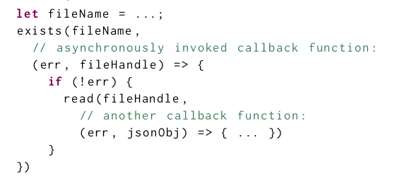
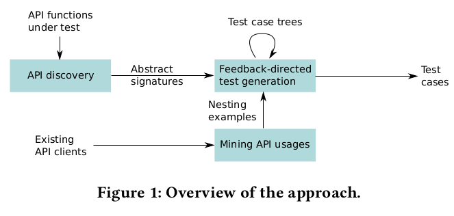
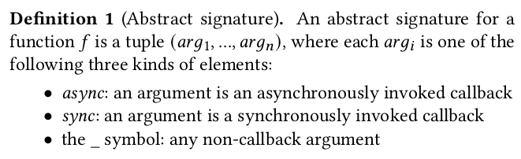
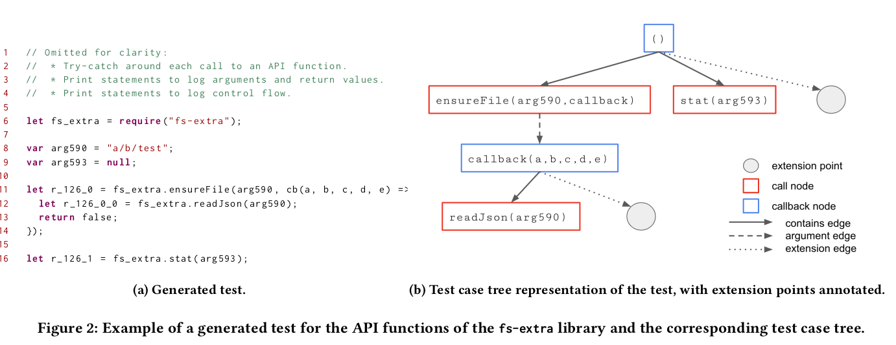
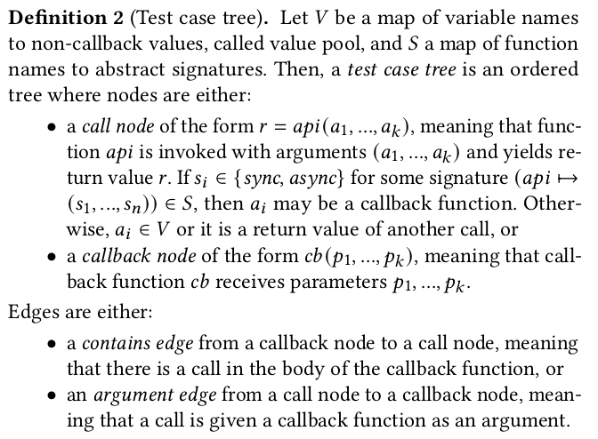
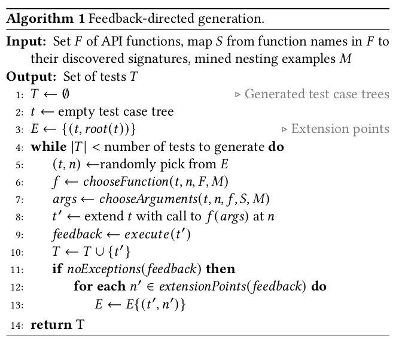
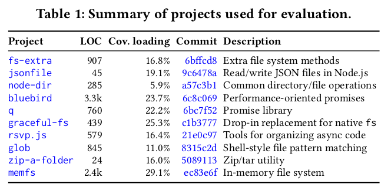
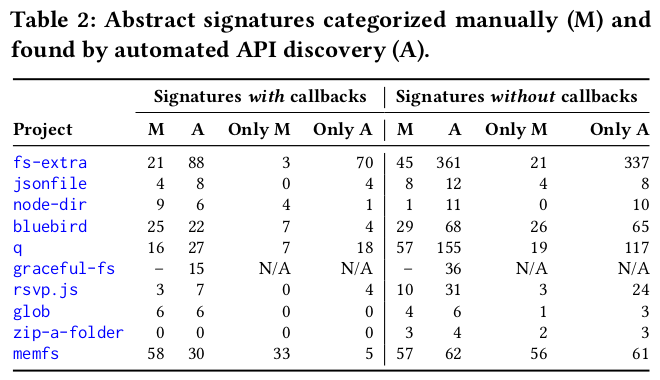
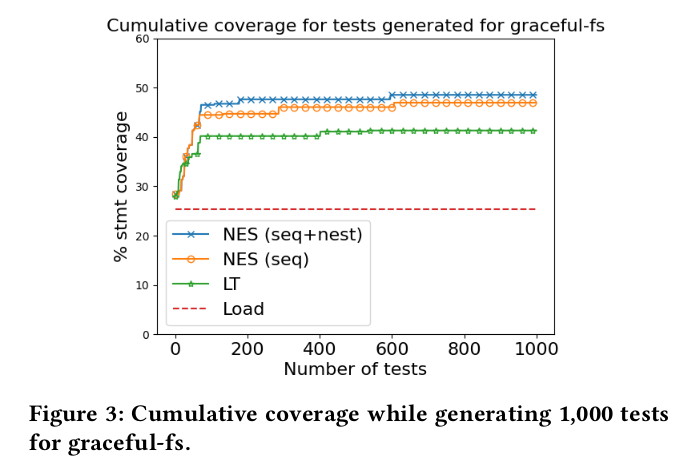
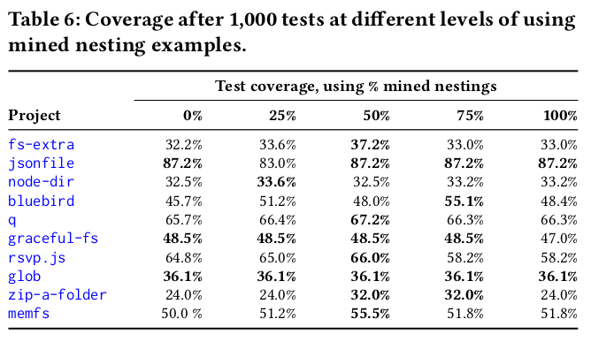

# Nessie: Automatically Testing JavaScript APIs with Asynchronous Callbacks (ICSE22)

## Motivation
- Previous algorithms for feedback-directed unit test generation iteratively create sequences of API calls by executing partial tests and by adding new API calls at the end of the test. However, these methods cannot deal with APIs that take callback functions as arguments.

## Contributions
- The first automated test generator specifically aimed at APIs that accept callbacks to be invoked asynchronously.
- An algorithm for incrementally generating tests that not
only sequence API calls but also nest them inside callbacks.
- Empirical evidence demonstrating that: 
    - The approach is effective at exercising JavaScript APIs with asynchronous callbacks 
    - It achieves modestly higher code coverage
and finds more behavioral differences than the state of the
art
    - It converges much more quickly than prior
work when it comes to achieving a specific level of coverage or behavioral differences.

## Movtivation Example

The call to **read** is nested in the callback that is passed to **exists**, to ensure that the read operation is executed after the **exists** operation has completed. Now suppose that the **read** operation contains a bug that is triggered in certain cases where a valid file-handle is passed (e.g., if the file’s permissions do not permit read access), and suppose that we want to generate a test that invokes the **read** function to expose the bug. Since file-handle objects are created inside the library, it is unclear what the representation of these
objects looks like without analyzing or executing the library code.  
While it is possible for a test generator to create suitable file-handle objects using a purely random approach, the chances of successfully creating a valid file-handle would be small. Therefore, the most effective way to obtain a valid file-handle and expose the bug is
to invoke **exists** with some callback function *f*, and invoke **read** with the file-handle that is passed to *f* as its second argument. That is, we would generate a test where a call to **read** is nested in the callback that is passed to **exists**, as in the above example.

## Approach
  

### API Discovery
Since JavaScript is dynamically typed, our approach needs to infer the signatures of functions as a prerequisite to generating effective tests.

  

To discover signatures for a given API function under test, Nessie
repeatedly invokes the function with randomly generated arguments. The approach alternates between generating calls with and without a callback argument, and passes different numbers of arguments.  
Nessie collects non-erroneous executions and distinguishes three cases:
- A callback that executes after the test has executed is executed (async)
- a callback that executes before the API call returns is executed synchronously (sync)
- the callback is not executed or the test does not pass any callback (_)

### Feedback Directed Test Generation
  

  

  

### Mining API Usages
Nessi uses a static analysis for mining nesting examples from real-world uses of APIs by traversing the ASTs of existing API clients. This analysis was implemented in CodeQL, using its extensive facilities for static analysis.

The test generator uses the set of mined nesting examples in **chooseFunction**. When selecting a function to be nested in the callback of some function 𝑓 , the set of nesting examples is consulted to find examples where 𝑓 outer matches 𝑓 . If such nesting examples exist, then one of the corresponding 𝑓inner functions is randomly
selected to be invoked inside 𝑓 ’s callback. Similarly, chooseArgu-
ment consults the selected nesting example to determine which arguments (if any) to reuse from the outer function or from the surrounding callback, and at what position(s).  
If no relevant mined nesting examples are available, an inner function is randomly selected.

## Evaluation
### Benchmarks
 

### Baselines and Variants of the Approach
We compare Nessie against the state of the art approach **LambdaTester** (LT). Because the original LT does not support language features introduced in ECMAScript 6 and later, and because parts of the implementation are specific to their benchmarks, we re-implemented LT within our testing framework. To better understand the value of nesting and sequencing, we evaluate two variants of Nessie: NES (seq), which uses sequencing only, and NES (seq+nest), which uses both sequencingand nesting.

### RQ1: Effectiveness of Automated API Discovery
Automated discovery finds 62% of documented
signatures that expect callback arguments, and 38% of signatures without callback arguments. It also discovers some undocumented signatures, which in several cases reflect unexpected behavior.

  

### RQ2: Coverage Achieved by Generated Tests
Nessie achieves a higher coverage than the state
of the art, and fewer tests are required to reach this coverage, in particular, when the approach uses both sequencing and nesting.

  

### RQ3: Finding Behavioral Differences during Regression Testing
Nessie finds many behavioral differences between
versions of libraries, including accidentally introduced bugs, bug
fixes, and API upgrades. These differences are found most quickly
with generated tests that use both sequencing and nesting.

### RQ4: Impact of Guidance by Mined Nesting Examples
Choosing mined nestings some of the time results
in tests with higher coverage than those generated always or never
using the mined nestings. The optimal parameter depends on the
library under test, but 50% is an overall reasonable choice.

  

### RQ5: Performance of Test Generation
With 15 to 30 seconds per 100 tests, the approach
is efficient enough for practical use. Extending the set of mined
nesting examples takes time proportional to the number of projects
mined but is an up-front cost.