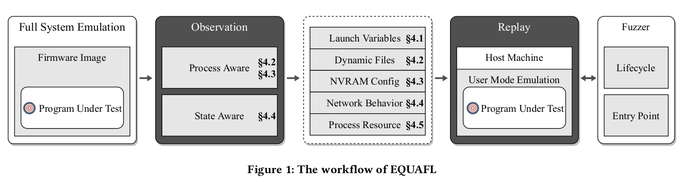

Efficient Greybox Fuzzing of Applications in Linux-Based IoT
Devices via Enhanced User-Mode Emulation (ISSTA 2022)
=====

## Motivation
- Greybox fuzzing is effective in finding vulnerabilities, yet it can not be directly applied to applications in IoT devices due to their specific system environments and hardware.
- Most fuzzing techiniques use full-system emulation, which is costly.
- Some previous works such as FirmAFL combines full-system emulation and user-mode emulation to speed up the fuzzing process, but no existing techniques can fully support use-mode emulation.
## Contributions
- EQUAFL, a novel technique that can automatically run embedded programs fully in user-mode, guaranteeing both high compatibility and high efficiency.
- Implementing EQUAFL based on AFL and QEMU.
- EQUAFL finds ten 0-day vulnerabilities in 70 real-world network applications.
- Source code: http://github.com/zyw-200/EQUAFL

## Background
### Full-system Emulation
Full-system emulation emulates the whole system, including the kernel, drivers and applications. 
- Advantage: High compatibility
- Disadvantage: Low efficiency. 

### User-mode Emulation
Emulate an individual linux application by delegating the syscalls to host machine.
- Advantage: High efficiency
- Disadvantage: Low compatibility (fail when the syscalls to delegate are not supported by host machine)  

Reasons why AFL+QEMU user-mode emulation fail:
- Wrong Launch Variables
- Missing dynamically generated files
- Inconsistent NVRAM configurations
- Inconsistent network behaviors
- Inconsistent process resource limits
- Lack of hardware

### Hybrid Emulation
FirmAFL executes user-space code in user-mode, and redirect syscalls to full-system emulation. However, a program with many syscalls significantly decreases FirmAFL's performance. 

### Notions
- PUT: Program Under Test
- PGD: Page Global Directory
- PID: Process Identifier
- PPID: PID of Parent Process

## Approach
  

The overall workflow of EQUAFL includes two steps: **observe** and **replay**.

**Observe:** Record key system behaviors that are related to failure reasons listed above.   
**Replay:** Deploy system resources such as dynamic configuration files on the host machine or perform the interception of system calls execution during the user-mode emulation.  

### Launch Variable Settlement
Launch variables are arguments and environment variables required to launch the tested program. Launch variables exist in various ways:
- Written in configuration files
- Hard-coded in binaries
- Passed by the parent process  

**Solution:** *Static pattern analysis* for Linux Kernel and *run-time analysis* during full-system emulation are used to identify launch variables.  

**Observation:** Instrument Linux kernel function `do_execve` to dump the required launch variables.

**Replay:**  Execute the target application in user-mode using the observed launch variables.

### Filesystem State Synchronization
Some applications may require some files such as configuration files before execution. In IoT devices, most of such files are generated dynamically during the booting process. However, user-mode emulation cannot correctly model updates in filesystems without the initialization of firmware.  

**Solution:** Observe file-related syscalls in the guest machine and re-execute it on host host machine. Repeat until PUT starts to run. Process-awareness is needed to get the correct syscall arguments (e.g. file discriptors).

**Process Identification:**
- Process Collection: Instrument `fork` and `execve` to obtain PGD, PID, PPID from each newly generated `task_struct`. 
- Process Inference: Identify the current executing process by PGD value stored in the specific register or memory regions.
