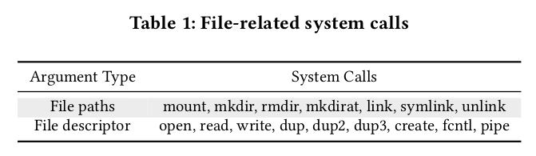
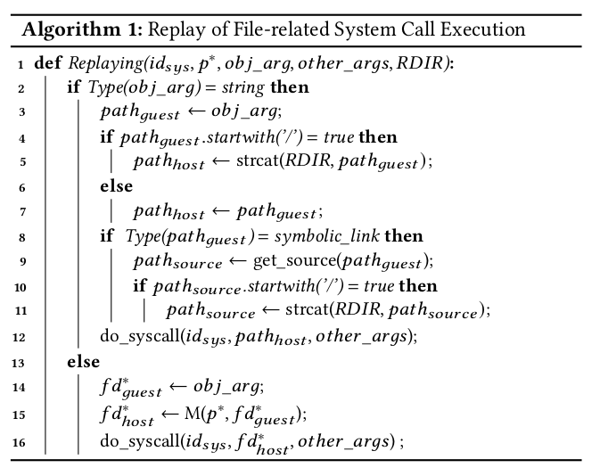
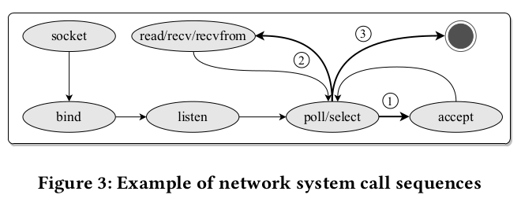
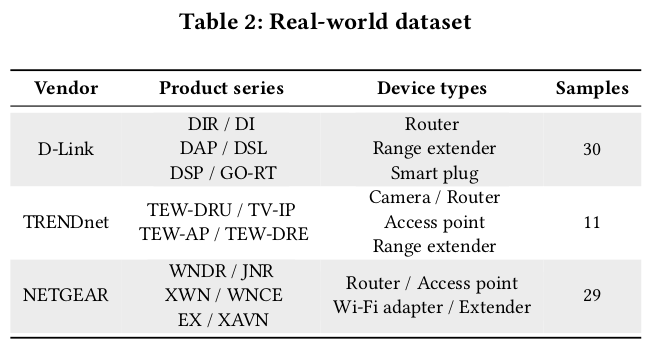
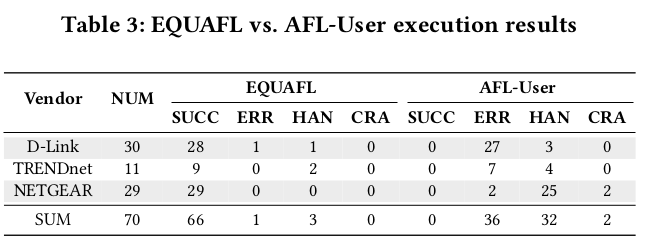
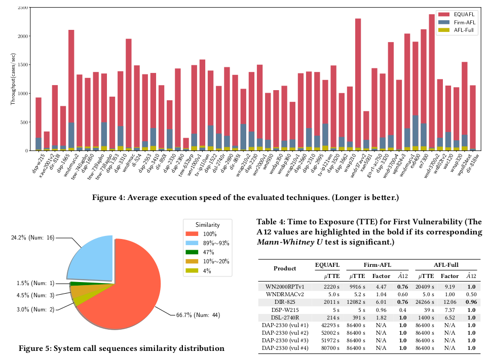
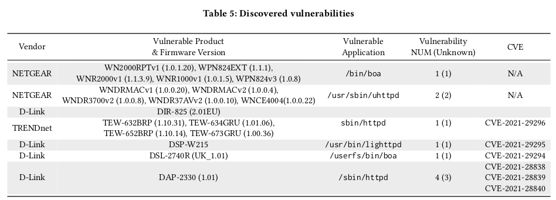

# Efficient Greybox Fuzzing of Applications in Linux-Based IoT Devices via Enhanced User-Mode Emulation (ISSTA 2022)

## Motivation
- Greybox fuzzing is effective in finding vulnerabilities, yet it can not be directly applied to applications in IoT devices due to their specific system environments and hardware.
- Most fuzzing techiniques use full-system emulation, which is costly.
- Some previous works such as FirmAFL combines full-system emulation and user-mode emulation to speed up the fuzzing process, but no existing techniques can fully support use-mode emulation.
## Contributions
- EQUAFL, a novel technique that can automatically run embedded programs fully in user-mode, guaranteeing both high compatibility and high efficiency.
- Implementing EQUAFL based on AFL and QEMU.
- EQUAFL finds ten 0-day vulnerabilities in 70 real-world network applications.
- Source code: http://github.com/zyw-200/EQUAFL
- Articact: https://doi.org/10.5281/zenodo.6580348

## Background
### Full-system Emulation
Full-system emulation emulates the whole system, including the kernel, drivers and applications. 
- Advantage: High compatibility
- Disadvantage: Low efficiency. 

### User-mode Emulation
Emulate an individual linux application by delegating the syscalls to host machine.
- Advantage: High efficiency
- Disadvantage: Low compatibility (fail when the syscalls to delegate are not supported by host machine)  

Reasons why AFL+QEMU user-mode emulation fail:
- Wrong Launch Variables
- Missing dynamically generated files
- Inconsistent NVRAM configurations
- Inconsistent network behaviors
- Inconsistent process resource limits
- Lack of hardware

### Hybrid Emulation
FirmAFL executes user-space code in user-mode, and redirect syscalls to full-system emulation. However, a program with many syscalls significantly decreases FirmAFL's performance. 

### Notions
- PUT: Program Under Test
- PGD: Page Global Directory
- PID: Process Identifier
- PPID: PID of Parent Process

## Approach
  

The overall workflow of EQUAFL includes two steps: **observe** and **replay**.

**Observe:** Record key system behaviors that are related to failure reasons listed above.   
**Replay:** Deploy system resources such as dynamic configuration files on the host machine or perform the interception of system calls execution during the user-mode emulation.  

### Launch Variable Settlement
Launch variables are arguments and environment variables required to launch the tested program. Launch variables exist in various ways:
- Written in configuration files
- Hard-coded in binaries
- Passed by the parent process  

**Solution:** *Static pattern analysis* for Linux Kernel and *run-time analysis* during full-system emulation are used to identify launch variables.  

**Observation:** Instrument Linux kernel function `do_execve` to dump the required launch variables.

**Replay:**  Execute the target application in user-mode using the observed launch variables.

### Filesystem State Synchronization
Some applications may require some files such as configuration files before execution. In IoT devices, most of such files are generated dynamically during the booting process. However, user-mode emulation cannot correctly model updates in filesystems without the initialization of firmware.  

**Solution:** Observe file-related syscalls in the guest machine and re-execute it on host host machine. Repeat until PUT starts to run. *Process*-*awareness* is needed to get the correct syscall arguments (e.g. file discriptors).

**Process Identification:**
- Process Collection: Instrument `fork` and `execve` to obtain PGD, PID, PPID from each newly generated `task_struct`. 
- Process Inference: Identify the current executing process by PGD value stored in the specific register or memory regions.  

**Observe:** For file-related syscalls that deal with file descriptors, `fd` on host cannot be easily derived from `fd` on guest. Therefore, process-awareness is needed to create the map between $fd_{guest}$ and $fd_{host}$  

1. Monitor syscall that creates a file (e.g. open), and get the returned file descriptor $fd_{guest}$

2. Identify current executing process $p$

3. Re-execute the syscall on host machine and get the returned file descriptor $fd_{host}$

4. Use the following equations to create $M$ that maps a file descriptor in guest process to a file descriptor on host
  $$
  \Delta FD_{guest} \leftarrow \{\forall fd' |fd' = DUP(fd) \land fd \in FD_{guest} \} \\
  FD_{guest} \leftarrow FD_{guest} \cup \Delta FD_{guest} \\
  P \leftarrow \{\forall p' | p'_{pid}=p_{pid} \lor p'_{ppid}=p_{pid}\} \\
  M: P \times FD_{guest} \mapsto fd_{host}
  $$
  
  

**Replay:** For each file-related system call invoked in the guest machine, re-execute it on the host machine to synchronize the file system state.  

- $id_{sys}$: the syscall we are replaying
- $p^*$: the process that executes $id_{sys}$ in the guest machine
- $obj_{arg}$: the argument of $id_{sys}$ that refers to the file object (either a path or a file descriptor)
- $other_{args}$: other arguments of $id_{sys}$
- $RDIR$: the absolute directory path of extracted firmware filesystem on the host machine

  

### NVRAM Configuration
NVRAM is a type of flash memory used by IoT devices to store configuration files.   
**Observe:** Full-system emulators such as Firmadyne allocate regular files to store NVRAM configuration data. Emulation of NVRAM is implemented by redirecting related APIs to data access in such files. These files can be generated on host machine as described previously.  
**Replay:** Use `LD_PRELOAD` to overwrite all NVRAM APIs with file operations on the host machine.

### Network Behavior
Network behaviors can be affected by the network interaction with the outside world.  
**Solution:** Learn the network state machine from observed syscall sequences. Then, emulate the network behavior of the PUT based on the state machine.  
**Observation:**  
1. Collect network related syscalls: monitor `type` parameter in `socket` syscall, collect returned $fd_{net}$ if `type` is equal to `AF_INET` or `AF_INET6`. After that, all syscalls executing on $fd_{net}$ are collected
2. Carry out the state machine

  

**Replay:** Instrument at the begining of network-related syscalls to feed the expected results.

### Process Resource Limits
Resource limits (e.g. RLIMIT_NOFILE) may affect PUT execution.
**Observation:** Monitor the result of `getrlimit` syscall in full-system emulation.  
**Replay:** Feed the expected result when `getrlimit` is first called in user-mode emulation.

## Implementation
**Observation:** Use [Firmadyne](https://github.com/firmadyne/firmadyne) to run full-system emulation, and instrument QEMU to collect relavant infomation.  
**Replay:** For launch-variables, filesystem state synchronization, NVRAM configuration,EQUAFL implements the replay mechanism by deploying the related resource directly on the host machine. For network behavior, process resource limits, EQUAFL implements the replay strategy by instrumenting the user-mode mode of QEMU.

## Evaluation
**Compatibility:** 
- Can EQUAFL successfully fuzz applications that cannot be fuzzed directly by AFL?  
- Are syscall traces of target applications in EQUAFL consistent with those in full-system emulation?

**Efficiency:** 
- How much overhead is introduced
in EQUAFL compared with pure user-mode emulation?
- Is EQUAFL efficient compared with AFL-Full and Firm-AFL?  

**Vulnerability discovery:** 
- Can EQUAFL successfully find vulnerabilities in real-world embedded firmware applications?

### Experiment Setup
Benchmarks
- Standard benchmarks: [nbench](https://www.math.utah.edu/~mayer/linux/bmark.html) and [lmbench](http://www.bitmover.com/lmbench/)
- 70 embedded firmware images from three major embedded device vendors including D-Link, TRENDnet and NETGEAR.
  

BaseLines
- AFL-User. AFL-User follows the default AFL setting, where user-
mode QEMU is used as the emulator.
- AFL-Full. AFL adapted for full-system emulation.
- Firm-AFL. SOTA greybox fuzzer that utilizes both full-system and user-mode emulation.

### Compatibility
  

**Result:** EQUAFL can execute all the programs in the standard dataset and most (66 out of 70) programs in the real-world
dataset successfully. Moreover, for the successfully executed
programs, their system call sequences are mostly identical
to full-system emulation. To conclude, the compatibility of
EQUAFL is comparable to full-system emulation and is much
better than pure user-mode emulation.

### Efficiency
  

**Result:** EQUAFL can execute the real-world applica-
tions 26 times faster than AFL-Full and 14 times faster than
Firm-AFL on average. Moreover, the overhead of EQUAFL
comparing to pure user-mode emulation is shown to be mar-
ginal on the standard dataset. This shows that EQUAFL enjoys
significantly better efficiency comparing to state-of-the-art
techniques.

### Vulnerability Discovery
  

**Result:** EQUAFL can detect vulnerabilities much faster
than AFL-Full and Firm-AFL. This demonstrates that the enhanced user-mode emulation of EQUAFL indeed helps to boost
the vulnerability detection capability of the greybox fuzzer.